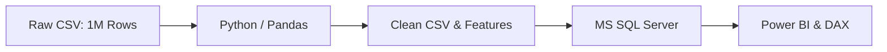

# 📊 Telecom Customer Churn & Retention Analysis

<p align="center">
  
  
  
  
</p>

---

## 📌 Project at a Glance

Customer churn is one of the biggest challenges for telecom companies. In this project, I analyzed a dataset of **1,000,000 subscriber records** to identify the root causes of churn, measure recurring revenue loss, and build a dynamic retention model.

### 💡 Core Metrics Snapshot
> 👥 **Total Customer Base:** 10,00,000 (10 Lakh Accounts)  
> 🔻 **Churned Users:** 2,60,158 (**26.02% overall churn rate**)  
> 💰 **Total Monthly Billing:** $1.40 Billion  
> 💸 **Monthly Lost Revenue:** **$364.32 Million** (~$4.37 Billion/year)  
> 📈 **ROI Impact (5% Reduction):** **+$18.22M saved/month** (**+$218.59M annual recovery**)

---

## 🖥️ Power BI Interactive Dashboards

### 1. Executive Summary & Revenue Impact
> Visualizing baseline KPIs, state-wise revenue bleed, dynamic What-If parameter, and high-risk accounts.

<p align="center">
  
</p>

* **Top Slicers:** Filter by State, Subscription Tier, Internet Type, Contract, and Payment Method.
* **State Revenue Risk:** Maharashtra ($91.29M) and UP ($90.94M) account for 50% of the entire lost revenue.
* **What-If Slider:** Management can test churn reduction from 1% to 15% in real time.
* **High-Risk Table:** Identifies churned users with cumulative spend over $179,000.

---

### 2. Churn Drivers & Behavioral Breakdown
> Deep-dive cohort analysis across infrastructure, contracts, plans, and support touchpoints.

<p align="center">
  
</p>

* **Contract Duration:** Month-to-Month accounts represent **45.2%** of churn due to zero exit barriers.
* **Internet Type:** Fiber optic users lead churn at **34.9%**, outranking DSL (25%) and 5G (20%).
* **Subscription Tier:** Basic plans account for **41.8%** of drop-offs, indicating entry-tier value gap.
* **Tech Support Paradox:** Users with support churn at **48.99%** vs **51.01%** without, proving support is not retaining customers.

---

## 🔍 Top 5 Key Insights

| # | Finding | Key Numbers | Business Meaning |
|---|---|---|---|
| **1** | **Month-to-Month Risk** | 1,17,582 accounts (45.2%) | No lock-in means users leave on the first billing or speed issue. |
| **2** | **Fiber Optics Drop-off** | 90,885 accounts (34.9%) | Premium service suffering from line drops or competitor pricing. |
| **3** | **Regional Concentration** | Maharashtra + UP = $182.2M loss | **50% of total revenue drain** is concentrated in just two states. |
| **4** | **The Tenure Paradox** | 25–72 month cohort = 66.6% | Old, loyal customers are leaving upon contract expiry (lack of loyalty perks). |
| **5** | **Support Ineffectiveness** | 49% churned had contacted support | Calls do not lead to retention; First-Contact Resolution needs overhaul. |

---

## 🛠️ Step-by-Step Technical Pipeline



### 1. Python (Data Cleaning & Feature Engineering)
* Cleaned whitespace (`.str.strip()`) and standardized text casing (`.str.title()`).
* Cast datatypes and verified zero duplicate `Customer_ID` rows.
* Created 4 custom business columns:
  * `Churn_Flag`: Binary `1/0` indicator for simple aggregation.
  * `Customer_Value`: `Tenure_Months * Monthly_Charges` to find VIP spenders.
  * `Tenure_Group`: Binned into `0-12`, `13-24`, `25-48`, `49-72` months.
  * `Age_Group`: Binned into `Young`, `Adult`, `Senior`.

### 2. SQL Server (Analytical Queries)
* Wrote group-by aggregations and churn rate queries in T-SQL:
```sql
SELECT 
    contract_type,
    COUNT(CASE WHEN Churn_Flag = 1 THEN 1 END) AS Churned_Count,
    CAST(ROUND(COUNT(CASE WHEN Churn_Flag = 1 THEN 1 END) * 100.0 / 
        (SELECT COUNT(*) FROM customer_churn WHERE Churn_Flag = 1), 2) AS DECIMAL(10,2)) AS Churn_Pct
FROM customer_churn
GROUP BY contract_type
ORDER BY Churn_Pct DESC;
```

### 3. Power BI (Dynamic DAX Modeling)
* **What-If Revenue Measure:**
```dax
Potential Monthly Revenue Saved = [Lost Monthly Revenue] * 'Churn Reduction %'[Churn Reduction Value]
Potential Annual Revenue Saved  = [Potential Monthly Revenue Saved] * 12
```

---

## 🎯 Practical Recommendations

1. **Convert Month-to-Month Subscribers:** Offer a 10%–12% discount or 1 free month to switch to 1-year agreements.
2. **Prioritize Fiber Line Quality in MH & UP:** Conduct regional network audits to fix downtime and jitter in high-bleed zones.
3. **Reward Loyal Customers (2+ Years):** Introduce 2nd and 4th anniversary speed bumps or streaming perks to prevent veteran drop-offs.
4. **Boost Basic Plan Value:** Add entry-tier perks (basic security suite) to improve perceived price-to-value.
5. **Empower Support with Retention Credits:** Allow support reps to give instant 20% billing discounts during reported outages.

---

## 📂 Repository Structure

```text
Customer_Churn_Analysis/
│
├── assets/
│   ├── Customer churn and retention overview.png  # Page 1 screenshot
│   └── Churn drivers.png                          # Page 2 screenshot
│
├── notebooks/
│   └── customer_churn_eda.ipynb    # Python cleaning & feature engineering
│
├── sql/
│   └── churn_analysis_queries.sql  # T-SQL analytical scripts
│
├── powerbi/
│   └── customer_churn.pbix         # Interactive Power BI report file
│
├── reports/
│   └── Project_Report.docx         # Detailed project documentation
│
├── .gitignore
├── LICENSE
└── README.md
```

---

## 👤 Author & Connect
**Deepanshu Bansal**  
* 💼 [LinkedIn Profile](https://www.linkedin.com/in/deepanshu-bansal-55db36)  
* 🐙 [GitHub Profile](https://github.com/bansal-deepu)  
* ✉️️ [Email](mailto:bansaldeepanshu1976@gmail.com)
